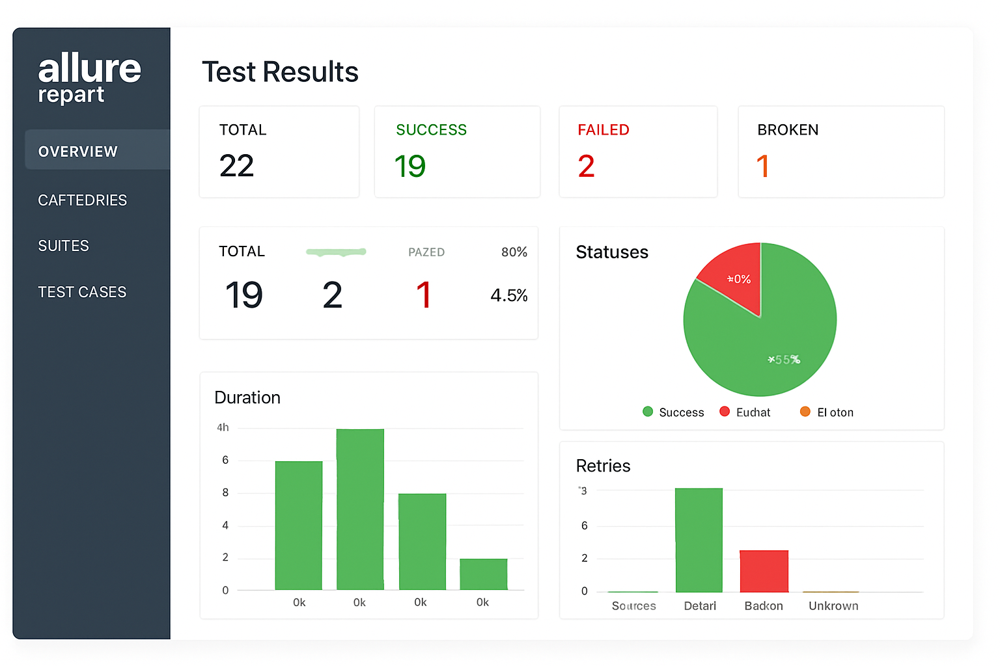

<div style="display: flex;">
    <a href="https://playwright.dev/">
        
    </a>
    <a href="https://www.python.org/">
        
    </a>
     <a href="https://www.python.org/">
        
    </a>
</div>


# Playwright API Python Framework
This repository contains a comprehensive API testing framework built using Python and Playwright. The framework is designed to streamline your API testing process and provide detailed reports with Allure.

### Initial Setup:
- Install and configure [Python3](https://www.python.org/downloads/)
- Setup your IDE (Preferably [Pycharm Community Edition](https://www.jetbrains.com/pycharm/download/#section=windows))
- Import cloned repository as project
- **Creating a virtual environment**.
   Open a terminal, move to the directory where you wish to create the virtual environment, and run the following command to create the virtual environment:

   Use `venv` (for Python 3.3+):

   ```bash
   python -m venv myenv
   ```
-  **Activate virtual environment**.
   To start using the virtual environment, you need to activate it. The activation command is slightly different for different operating systems:

   - on macOS and Linux:

    ```bash
     source myenv/bin/activate
    ```

   - On Windows (using Command Prompt):

    ```bash
     myenv\Scripts\activate
    ```

   - On Windows (using PowerShell):

    ```bash
     .\myenv\Scripts\Activate.ps1
    ```
 
   Once the virtual environment is activated, you will see the name of the virtual environment in front of the terminal prompt, indicating that you are in the virtual environment.

  - Install all required packages using this command
    ```sh
    pip install -r requirements.txt
    ``` 

## Project Structure

```plaintext
Playwright_API_Python_Framework/
    │
    ├── testcases/  	          
    │   ├── test_1_auth.py       
    │   ├── test_2_create_booking.py       
    │   ├── test_3_update_booking_by_ID.py       
    │	├── test_4_get_booking_by_ID.py       
    │	├── test_5_delete_booking_by_ID.py            
    │   └── ...
    ├── testData/                   
    │   ├── createAuth.json      
    │   ├── createBooking.json     
    │   ├── updateBooking.json 
    │   ├── getBookingByID.json	
    │   ├── deleteBookingByID.json
    │   └── ...
    ├── API_Utilities/
    │   ├── api_actions.py  
    │   ├── api_utilities.py  
    │   ├── api_validations.py  
    │	├── file_reader.py  
    │   ├── logger_utility.py  
    │	├── Shared_API_Data.py  
    │	├── upload_file.py 
    │   └── ...
    ├── AutoLogs/
    ├── allure-results/
    ├── execution_reports/
    ├── pytest.ini              
    ├── requirements.txt  
    ├── conftest.py  
    ├── .env.staging
    ├── .env.prod

```
## Key Functionalities

### API Utilities

#### api_actions.py
- `get_request`: Performs HTTP GET requests.
- `post_request`: Handles HTTP POST requests.
- `put_request`: Executes HTTP PUT requests.
- `patch_request`: Performs HTTP PATCH requests.
- `delete_request`: Handles HTTP DELETE requests.

#### api_utilities.py
- `get_response_code`: Retrieves the HTTP status code from the API response.
- `get_response_data`: Extracts the data from the API response.
- `get_value_from_response`: Fetches a specific value from the JSON response using a JSONPath expression.

#### api_validations.py
- `validate_response_code`: Validates the API response code.
- `validate_entire_response_body_data`: Compares the entire response body with expected data.
- `validate_in_response_body`: Validates specific data in the response body using JSONPath.
- `validate_schema`: Validates the JSON response against a provided schema.

#### file_reader.py
- `read_file`: Reads and returns data from a JSON file.
- `get_file_with_json_extension`: Constructs and returns the full path to a JSON file.

#### logger_utility.py
- `customLogger`: Creates and configures a custom logger for logging messages.

#### Shared_API_Data.py
- `SharedData`: A dataclass for storing and retrieving shared data within the framework.
- `set_data`: Sets a value for a given key in the shared data.
- `get_data`: Retrieves the value associated with a given key.


## Allure Report

After running the tests, you can generate and view the Allure Report for detailed test results and analytics. 

To generate the report, run:
```bash
allure generate allure-results --clean -o allure-report
```

To serve the report locally, run:
```bash
allure open allure-report
```


## Running Tests

Tests can be executed against different environments (e.g., `staging`, `prod`) using the `--env` pytest flag. Ensure you have the corresponding `.env.<environment_name>` file in the project root.

To run tests for a specific environment, use the following command:

```bash
pytest --env=<environment_name>
```

For example, to run tests against the `staging` environment with specific markers and caching cleared:

```bash
pytest testcases/ -s -v --cache-clear --env=staging -m Positive
```
For example, to run tests against the `prod` environment with specific markers and caching cleared:

```bash
pytest testcases/ -s -v --cache-clear --env=prod
```





